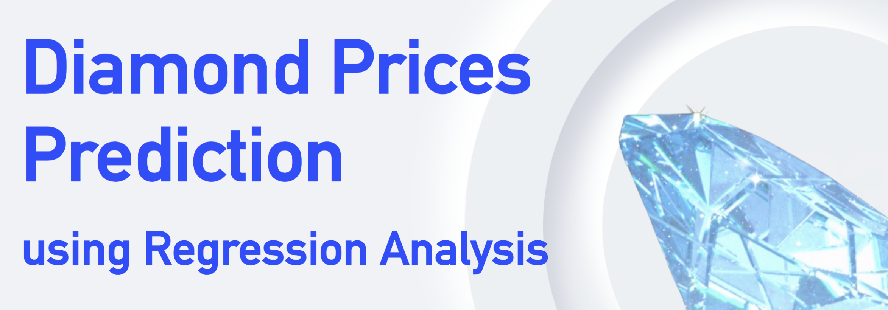

The analysis encompasses three regression models and handles multi-collinearity among predictors and prevents model overfitting. A range of techniques like visualization, exploratory data analysis, model diagnostics, and train-test split are used to ensure the models' reliability. The selected model achieves 0.9848 in R-squared. See the [project report](4130_proj.pdf) and [presentation slides](pre.pdf) for more details.