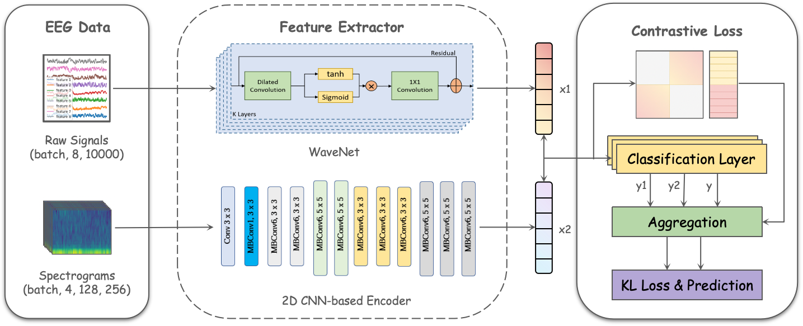
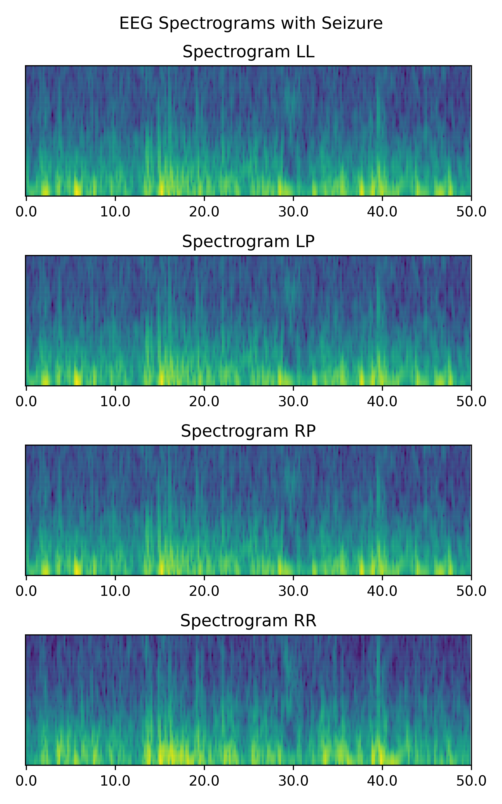
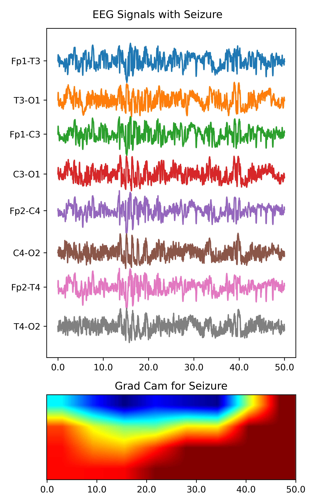

### Introduction

Electroencephalography (EEG) is a non-invasive method of monitoring and recording electrical activity in the brain, which plays a crucial role in diagnosing and treating various brain-related disorders, particularly in critically ill patients. However, the manual interpretation of EEG data remains a major bottleneck in neurocritical care, as it is time-consuming, expensive, and prone to fatigue-related errors and inter-rater reliability issues. To address these challenges, there is a pressing need to develop automated methods for EEG analysis. The objective of this research is to develop a robust model trained on EEG signals to automatically detect and classify seizures and other types of harmful brain activity, aiming to assist doctors and brain researchers in providing faster and more accurate diagnoses and treatments. This work has significant implications for improving patient care in neurocritical settings, advancing epilepsy research, and supporting the development of new therapeutic interventions.

### Data Distribution
| **Symptom**                 | **Ratio**     | **Description**|
|-----------------------------|---------------|-----------------|
| Seizure                     | 0.16 (2785)   | Uncontrolled electrical activity in the brain |
| LPD                         | 0.15 (2577)   | Lateralized periodic discharges|
| GPD                         | 0.11 (1787)   | Generalized periodic discharges|
| LRDA                        | 0.05 (916)    | Lateralized rhythmic delta activity (slow-wave activity in one hemisphere of the brain)|
| GRDA                        | 0.11 (1828)   | Generalized rhythmic delta activity (slow-wave activity in both hemispheres of the brain)|
| Other                       | 0.42 (7196)   | |

### Model Prototype

  

### Grad-CAM

  
  

### Comment
The data size is quite large (26.4GB) and also accelerator is required to run this project, so we highly recommend you to run the code in Kaggle, and you can directly load data inside from [the hms page](https://www.kaggle.com/competitions/hms-harmful-brain-activity-classification/overview). Great thanks to [Nischay Dhankhar](https://www.kaggle.com/code/nischaydnk/training-multimodal-1d-2d-approach-eegs).