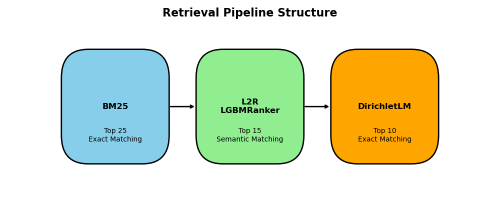
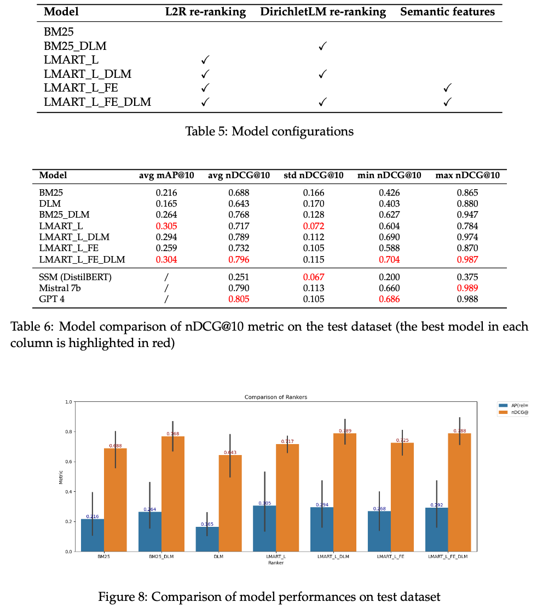
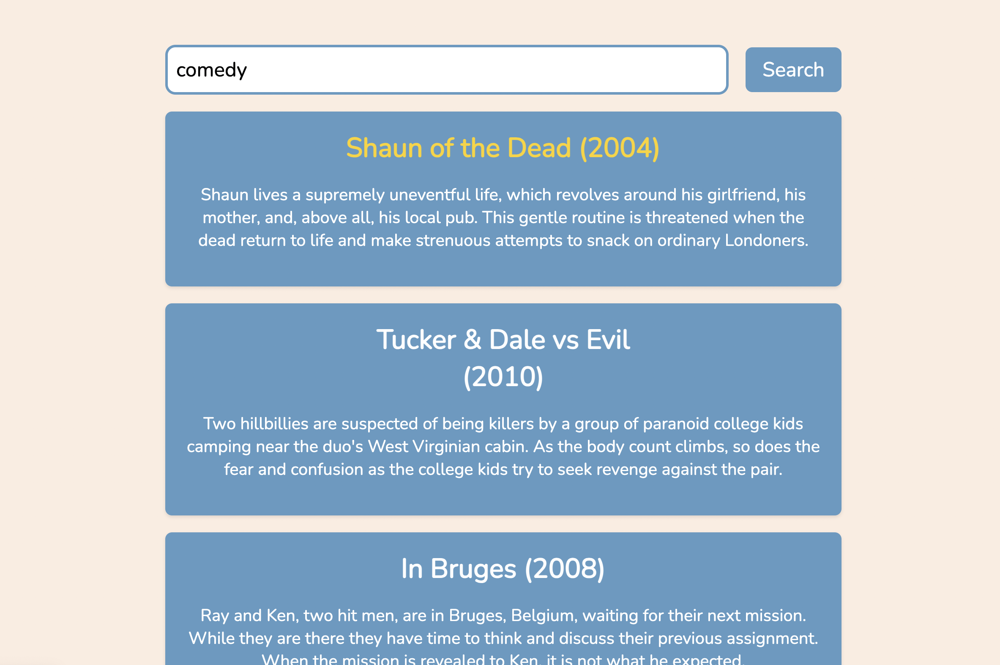
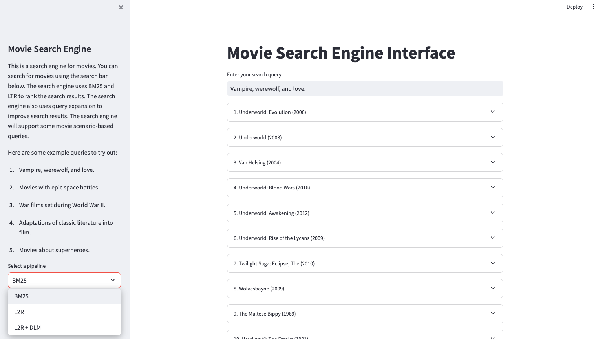

### Abstract
In the modern entertainment landscape, finding the perfect movie across numerous streaming platforms has become a challenging task. Current recommendation systems often fall short, relying on generic algorithms or user ratings that overlook individual preferences. Our project addresses this challenge by redefining the movie discovery experience. Unlike traditional approaches, our innovative pipeline combines exact matching with semantic understanding and refined re-ranking. This approach not only achieves a notable increase of 0.11 in nDCG@10 over the baseline BM25 but also aligns more closely with user intent and content relevance. It even gets a comparable result to Mistral-7b and GPT-4 (in the zeroshot mode).




### Design
We create a retrieval pipeline based on BM25. Then, we consider re-ranking the retrieved results with our Learning-to-rank (L2R) with LGBMRanker and DirichletLM. We design the pipeline in this manner because we need to filter out the most 25 relevant movies with exact matching (BM25), then find the top 15 movies with semantic matching (L2R), and finally use the exact matching (DirichletLM) to find the top 10 results. We will do the ablation study on this to see how each part would improve the performance.



### Usage

1. Install Python 3.11 (preferred)
2. Install Java to support PyTerrir
3. see requirements.txt

#### Flask Frontend
1. Run the following command to start the backend:
    ```bash
    python3 backend.py
    ```

2. Open `index.html` in your web browser.

3. You can now use the search engine!

<div align="center">
    
</div>

#### Streamlit
1. run the following command to start
    ```bash
    streamlit run run.py
    ```
2. You can select the models in the sidebar
<div align="center">
    
</div>
