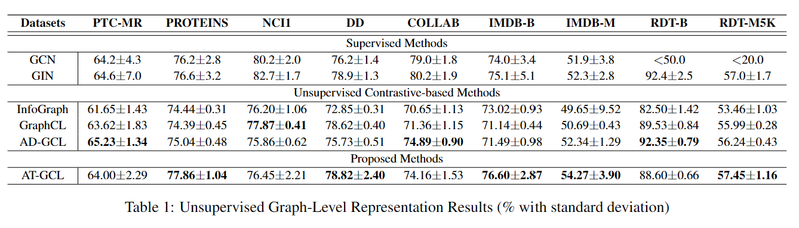

## Contrastive Learning on Graph Representation

- Cultivated a solid comprehension of machine learning frameworks through the detailed comparative analysis of established paradigms in GNN, computer vision (CV), and NLP.
- Proposed random masking and attention mechanism in the graph augmentation.
- Surpassed baseline models in 5 out of 9 datasets by tuning the model in the ablation study.
- Unveiled the interconnection in these fields: the importance of capturing local context, global information, and interaction.
- Identified that attention mechanism (interaction) might be good at evaluating importance (local context), but might also destory the structure (global information).

