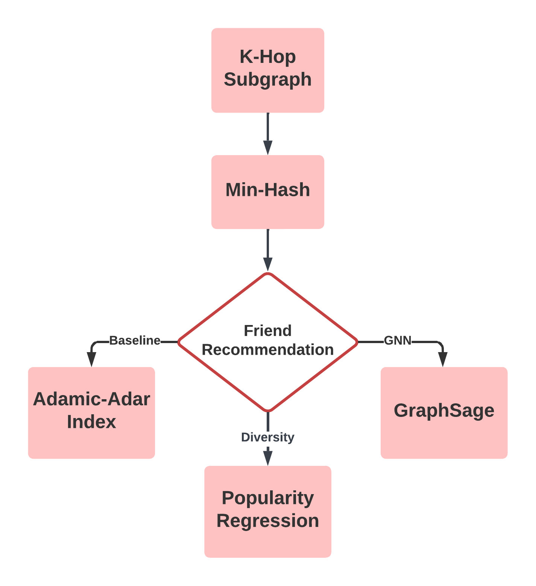

## Introduction

With the rise of deep learning and machine learning, many retailers adopt recommendation systems to increase their competitive ability in the market. Yelp platform has published an extensive dataset about its user and business profiles (around 9 GB). Many researchers have explored the dataset, but few of them focus on friend recommendations with users. In this project, the k-hop sub-graph or the ego-net of one specific user will be analyzed to provide diverse recommendations

## Task

Due to the data size, we will focus on the sub-graph of the data obtained from the breadth-first search in PySpark and the following tasks:

1. We will use the Jaccard similarity of the reviewed businesses to define the similarity of the users. It intends to find similar users through collaborative filtering.Since the data is large, we will implement the MinHash to approximate the Jaccard similarity.
2. The friend recommendation here is the link prediction task in the graph, so we will use the Adamic-Adar index as the baseline and GraphSage model to further improve it.
3. The previous recommendations are based on similarity, so we will also recommend the elite users to the users to increase the diversity of the recommendation. In this case, we use the\
   number of fans as the metrics and other information to predict the popularity of the user with ridge regression, random forest, and MLP.

## Code

Please see the report and code [here ](https://github.com/frankling2020/UMSI-Projects/tree/main/si671prj)

## Procedure

1. Clean the dataset and extract useful information from the original data with a JSON file.
2. Prepare for the implementation of friend recommendations on the k-hop sub-graph (or egonet) extracted by breadth-first search (BFS).
3. Use MinHash to approximate the Jaccard Similarity of shops by users to define the user similarities.
4. Use the Adamic–Adar index to predict the user’s relationship(or links) as a baseline.
5. Adapt the GraphSage to predict links between users.
6. Regress the number of fans for each user by linear regression, random forest, and MLP with the criterion of R-Squared

## Sample User Profile

To help reader gain a clearer impression for our work, we use a sample user and shows his statistics. His name is Gigi, whose user ID is 4476724 and has 327 friends on Yelp. 1184 of his comments are marked as funny comments, and 1567 of them are useful.

According to our methodology, he has a Jaccard similarity of 0.314 with one of his friends Mark, whose user ID is 5495693 and has 465 friends.3175 of his comments are marked as funny comments, and 5685 of them are useful.

Then, using our link prediction and regression methods, we would recommend Nick (5236527), Tim (2568097), and Sue (4978186) who also contribute lots of useful votes and owned friends but have fewer fans.